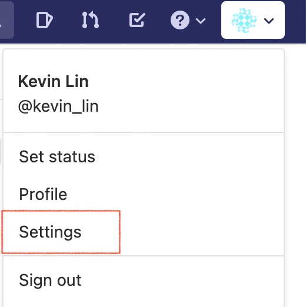
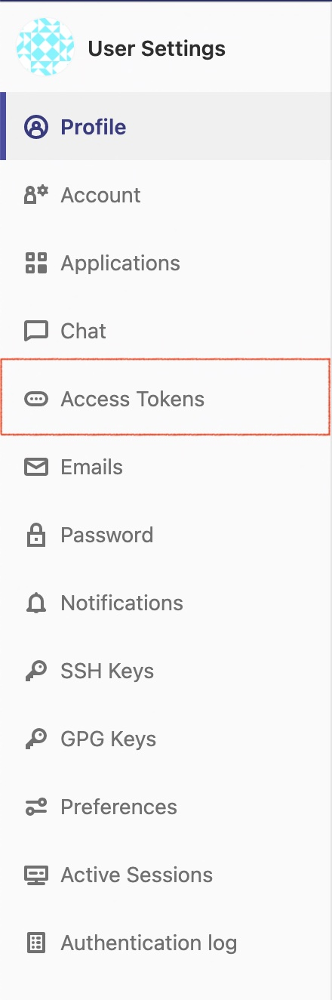
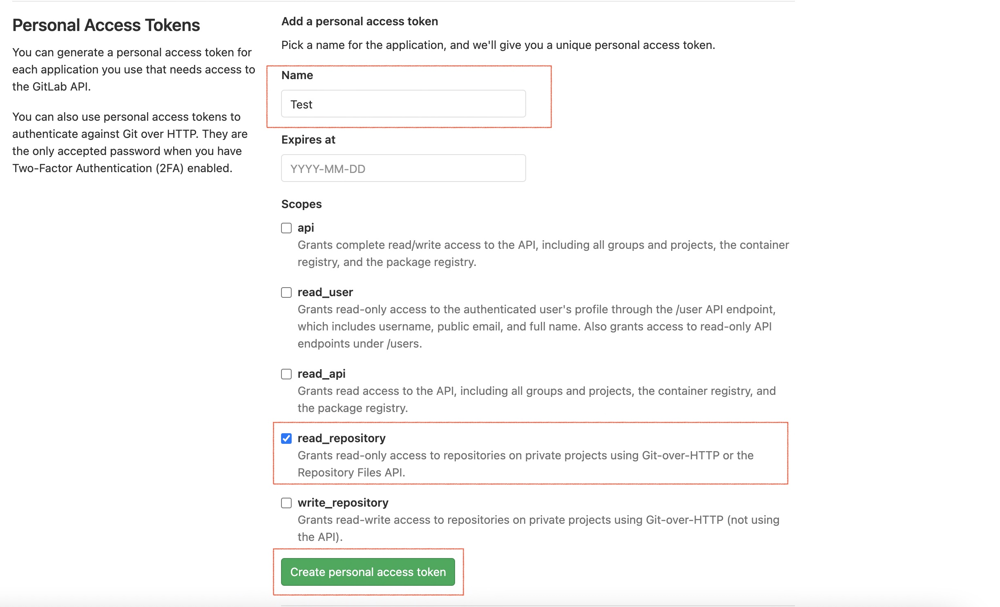
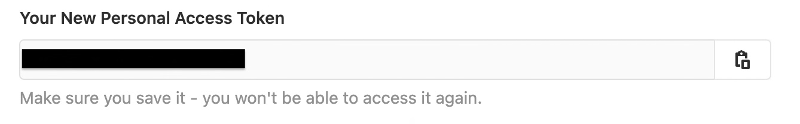

# CCSL

Cloud Common Shared Library

## Installation
```bash=
go get gitlab.ninthbase.com/commons/cgsl
```

## Usage
If you use SSH key to login gitlab you can jump to [Setting Go](#Setting-Go) section for further usage. If not you have to following below steps to use this package. Otherwize, if you want to use password directly yot can jump to [Setting Git](#Setting-Git) section.

#### Creating a token
1. In the upper-right corner of any page, click your profile photo, then click **Settings**.



2. In the left sidebar, click **Access Tokens**.



3. Give your token a descriptive name and select **read_repository** then click **Click Generate token**



4. Save your access token



#### Setting Git
Add a line to the $HOME/.netrc file that git consults:
```bash=
machine gitlab.ninthbase.com login ${USERNAME} password ${ACCESS_TOKEN}
```

#### Setting Go
To permits fetching from repositories and resolving custom domains using insecure schemes such as HTTP, and also bypassess module sum validation using the checksum database. 

We need to setting GOINSECURE and GOPRIVATE environment variable
```bash=
go env -w GOPRIVATE="gitlab.ninthbase.com/*"
go env -w GOINSECURE="gitlab.ninthbase.com/*"
```